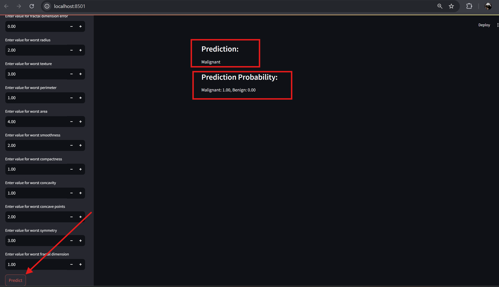

# Breast Cancer Prediction using ANN

This project predicts whether a breast tumor is **malignant** or **benign** using an Artificial Neural Network (ANN). The model is trained on the Breast Cancer dataset from `scikit-learn` and deployed using **Streamlit** for an interactive web interface.

## Table of Contents
1. [Overview](#overview)
2. [Dataset](#dataset)
3. [Project Structure](#project-structure)
4. [Setup and Installation](#setup-and-installation)
    - [1. Create and Activate Virtual Environment](#1-create-and-activate-virtual-environment)
    - [2. Install Dependencies](#2-install-dependencies)
5. [How to Run](#how-to-run)
6. Outputs

---

## Overview

This project uses:
- **Artificial Neural Network (ANN)** implemented with `scikit-learn`.
- **Feature scaling** (`StandardScaler`) and **feature selection** (`SelectKBest`) to optimize model performance.
- **Streamlit** for building an interactive web-based user interface.

Users can input tumor characteristics into the app to predict whether a tumor is malignant or benign, with probabilities displayed for each class.

---

## Dataset

The dataset is the **Breast Cancer dataset** provided by `scikit-learn`, containing the following:
- **30 features** such as mean radius, texture, perimeter, area, etc.
- **2 target classes**:
  - 0: Malignant (cancerous)
  - 1: Benign (non-cancerous)

---

## Setup and installation 

- Create venv
'''bash 
    - python -m venv Name
- Activate environment 
    - source Name/Scripts/activate
- Install requirements.txt
    - pip install -r requirements.txt
- Run streamlit app
    - streamlit run streamlit.py

## Output
